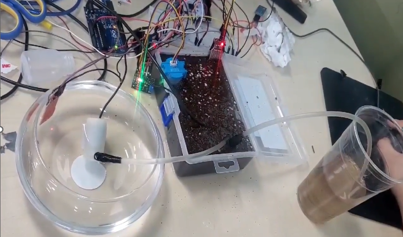
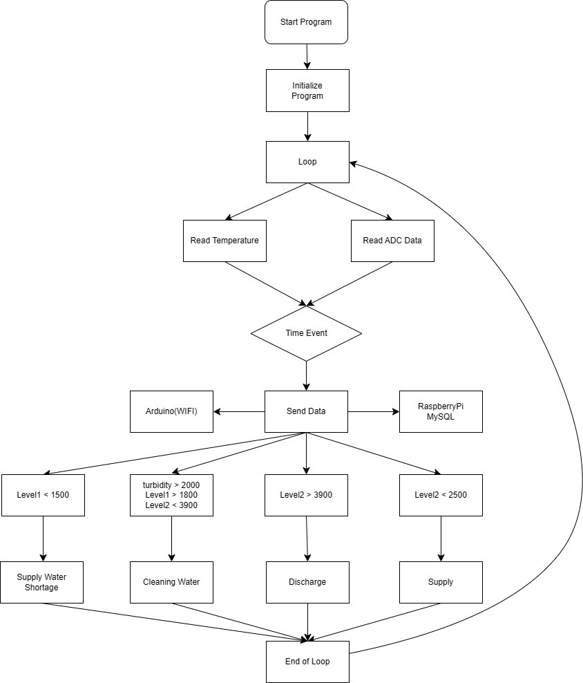
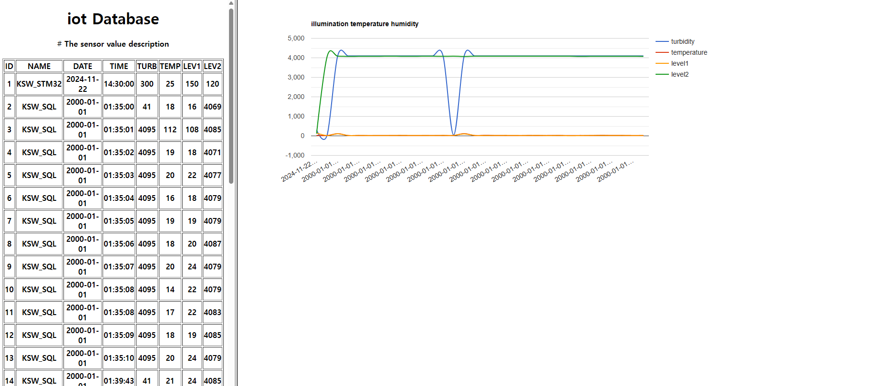
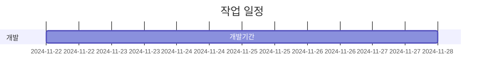

# 🛣️ Smart Fish Tank Management System

  - 자동화된 어항 관리 시스템으로 **STM32**, **Arduino**, **Raspberry Pi**를 사용하여 수질 상태를 모니터링하고, 데이터를 LCD 화면과 Apache 웹 인터페이스를 통해 실시간으로 확인 가능.


<br><br>

## 📁 프로젝트 간략 소개

- 탁도, 온도, 수위 등 주요 수질 데이터를 관리하며 이상 상태 발생 시 알림 제공.
  - **Wi-Fi**를 통해 데이터를 서버로 전송하여 원격 모니터링 지원.
  - Apache와 SQL 기반 웹 대시보드에서 시각화 및 분석.

## 💻 프로젝트 내용

### 🎯 목적
- 어항의 수질 상태를 실시간으로 모니터링하고, 원격으로 관리 가능하게 하는 시스템 구축.

### 🕵️ 문제
- 바쁜 일상으로 어항 상태를 관리하지 못해 어류의 건강에 악영향을 미치는 문제.
- 수질 이상 상태를 놓치기 쉬운 기존 어항 시스템의 한계.

### 🎣 목표
- a. **Wi-Fi**를 이용해 데이터를 서버로 전송하고 원격 모니터링 구현.
- b. 센서를 통해 수질 데이터를 실시간으로 수집하여 LCD 화면에 표시.
- c. Apache와 SQL 기반의 웹 대시보드를 통해 시각화.
- d. 이상 상태 발생 시 사용자 알림 기능 제공.

## 🗂️ 파일 구성

```
Fish_Tank_Project/
├── stm32/                  # STM32 소스 코드
├── arduino/                # Arduino 소스 코드
│   └── Main.ino            # 주요 Arduino 스케치 파일
├── raspberry-pi/           # Raspberry Pi 서버 코드
│   ├── web/                # Apache 웹 파일 (PHP, HTML, CSS)
│   └── database/           # SQL 스키마 및 스크립트
└── README.md               # 프로젝트 문서화
```

## 🛠️ 기술 스택

### **하드웨어**
- **STM32 마이크로컨트롤러**
- **Arduino** (ESP8266/ESP32 Wi-Fi 모듈 포함)
- **Raspberry Pi** (서버 역할)
- **LiquidCrystal I2C 16x2 LCD** (디스플레이)
- **탁도 센서**
- **온도 센서**
- **수위 센서**
- **전원 공급 장치**

### **소프트웨어**
- **프로그래밍 언어**: C, Python, PHP, SQL
- **웹 서버**: Apache
- **데이터베이스**: MySQL
- **기타 도구**:
  - **OpenCV**: 데이터 시각화
  - **STM32CubeIDE**, **Arduino IDE**: 펌웨어 작성

## 📊 시스템 구성도

- **시스템 구성**


<br><br>

- **Apache를 통한 데이터 시각화**


<br><br>

## 🗓 일정


### 👇 Let's Connect

[](https://github.com/Kwonsiwoo2)  [](https://www.linkedin.com/in/%EC%8B%9C%EC%9A%B0-%EA%B6%8C-064765341/)

